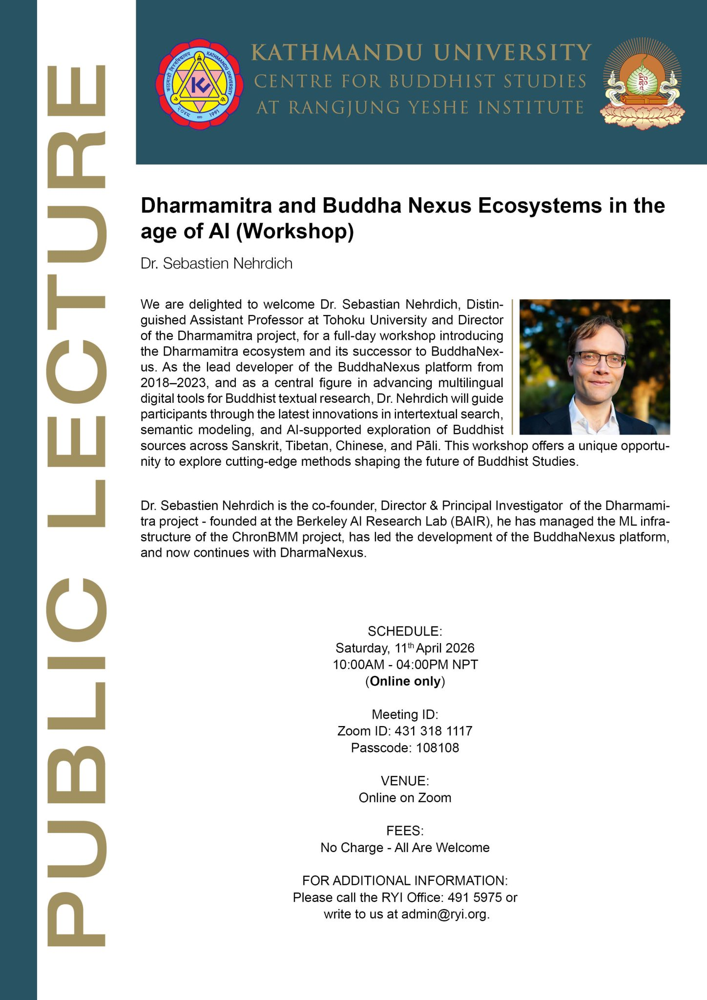
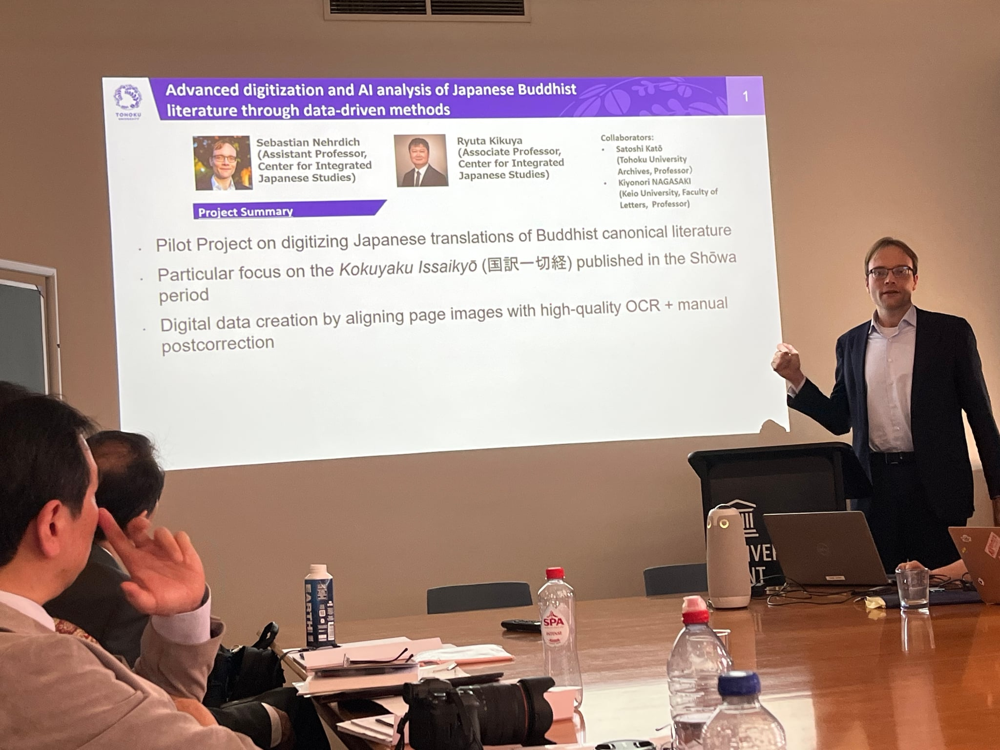
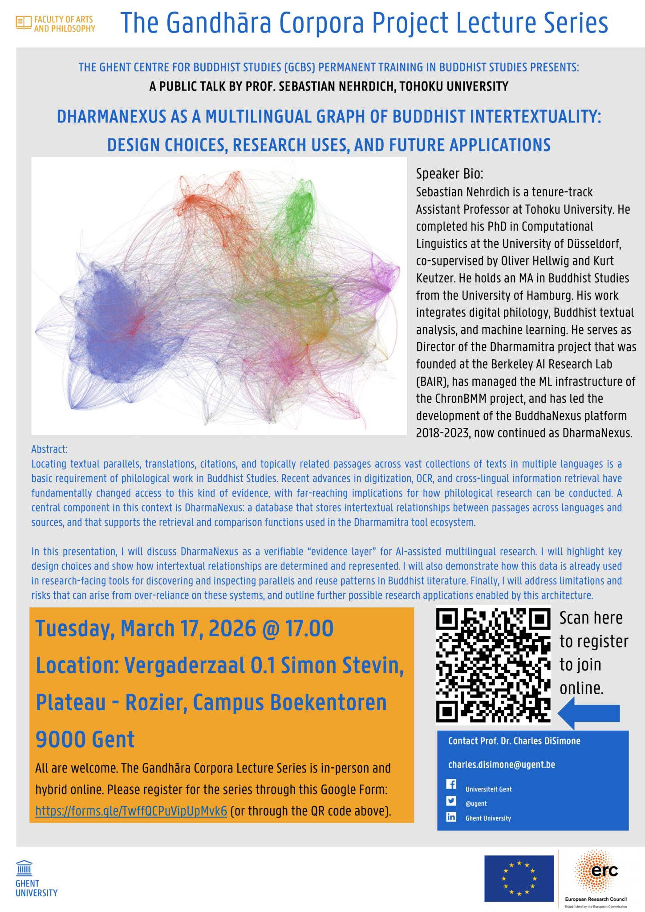

## Invited Talks

### Dharmamitra and Buddha Nexus Ecosystems in the age of AI with Dr. Sebastien Nehrdich
**April 11, 2026**

*[Workshop,](https://ryi.org/news/workshop-dr-sebastien-nehrdich) Kathmandu University Centre for Buddhist Studies at Rangjung Yeshe Institute, Kathmandu, Nepal*

We are delighted to welcome Dr. Sebastien Nehrdich, Distinguished Assistant Professor at Tohoku University and Director of the Dharmamitra project, for a full-day workshop introducing the Dharmamitra ecosystem and its successor BuddhaNexus. As the lead developer of the BuddhaNexus platform from 2018–2023, and a central figure in advancing multilingual digital tools for Buddhist textual research, Dr. Nehrdich will guide participants through the latest innovations in intertextual search, semantic modeling, and AI-supported exploration of Buddhist sources across Sanskrit, Tibetan, Chinese, and Pāli. This workshop offfers a unique opportunity to explore cutting-edge methods shaping the future of Buddhist Studies.

---

### Dharmamitra: A Platform to Support Research across Language Boundaries on Buddhist Textual Material
**March 20, 2026**

*[Workshop,](https://cijs.oii.tohoku.ac.jp/en/news/detail---id-129.html) Japanese Studies in Japan and Belgium, organised b The Center for Integrated Japanese Studies (CIJS), Tohoku University and the Ghent University Institute for Japanese Studies Ghent University, Belgium*

The Center for Integrated Japanese Studies (CIJS) at Tohoku University will host a two-day workshop titled "Japanese Studies in Japan and Belgium" on March 19 and 20, 2026. The event will be held at Ghent University, Belgium, and is co-organized with the Ghent University Institute for Japanese Studies. Ghent University is renowned as one of Europe's leading hubs for Japanese Studies and has maintained a strong academic partnership with Tohoku University through the Hasekura League.

The program will feature an introduction to CIJS activities by Director Hiroaki Adachi, followed by annual reports from all 11 ongoing CIJS collaborative research projects. Additionally, six faculty members from CIJS will deliver research presentations. From Ghent University, Prof. Dr. Andreas Niehaus, who serves as the President of the EAJS (European Association for Japanese Studies), will also be a featured speaker.

The workshop will be streamed online to EAJS members across various countries, providing a significant opportunity to promote CIJS activities throughout Europe. A detailed report on the results of the workshop will be published on our website at a later date.

[Program](https://cijs.oii.tohoku.ac.jp/media/files/%E3%83%AF%E3%83%BC%E3%82%AF%E3%82%B7%E3%83%A7%E3%83%83%E3%83%97%E3%83%97%E3%83%AD%E3%82%B0%E3%83%A9%E3%83%A0%EF%BC%9AMarch_Japanese%20Studies%20in%20Japan%20and%20Belgium.pdf)

---

### DharmaNexus as a Multilingual Graph of Buddhist Intertextuality: Design Choices, Research Uses, and Future Applications
**March 17, 2026**

*[Lecture](https://www.cbs.ugent.be/uncategorized/guest-lecture-dharmanexus-as-a-multilingual-graph-of-buddhist-intertextuality-design-choices-research-uses-and-future-applications-by-sebastian-nehrdich-march-17-2026/), The Gandhāra Corpora Lecture Series, Faculty of arts and Philosophy, Ghent University, Belgium*

Locating textual parallels, translations, citations, and topically related passages across vast collections of texts in multiple languages is a basic requirement of philological work in Buddhist Studies. Recent advances in digitization, OCR, and cross-lingual information retrieval have fundamentally changed access to this kind of evidence, with far-reaching implications for how philological research can be conducted. A central component in this context is DharmaNexus: a database that stores intertextual relationships between passages across languages and sources, and that supports the retrieval and comparison functions used in the Dharmamitra tool ecosystem.

In this presentation, I will discuss DharmaNexus as a verifiable “evidence layer” for AI-assisted multilingual research. I will highlight key design choices and show how intertextual relationships are determined and represented. I will also demonstrate how this data is already used in research-facing tools for discovering and inspecting parallels and reuse patterns in Buddhist literature. Finally, I will address limitations and risks that can arise from over-reliance on these systems, and outline further possible research applications enabled by this architecture.

Speaker: Professor Sebastian Nehrdich, Tohoku University

---

### Is this the end of (Buddhist) philology as we know It? If so, what’s next?
**March 13, 2026**

*[Hybrid lecture](https://www.iias.asia/events/end-buddhist-philology-we-know-it-if-so-whats-next), International Institute for Asian Studies, Leiden University, Netherlands*

With rapidly growing digital collections and increasingly powerful AI and information-retrieval tools, textual Buddhist Studies is undergoing a paradigm shift. How are these new tools already influencing research practice, and what new questions and methods might they enable in the near future?

The Lecture

As Buddhist textual corpora rapidly expand across multiple languages through digitization, OCR, and large-scale data integration, the practical conditions of research in textual Buddhist Studies are changing. At the same time, with the advent of new technologies such as semantic search systems, cross-lingual alignment, advanced machine translation, and AI-guided synthesis, there are now methods to query and interact with this data that can seamlessly cross language barriers. This, in turn, changes what kinds of skillsets are actually needed for philological interaction with the textual material of Buddhist traditions. These tools make it possible for individual researchers to surface parallels, matching translations, variant readings, and related material at a scale that was previously impossible even for research teams. They are not mere additions to existing workflows: they resolve specific bottlenecks and enable new ways of interacting with the sources, from rapid exploration across corpora to targeted verification through close reading.
This talk will discuss what tools are currently available, how they are already being used in philological research, and what directions these technological developments might take in the immediate future. It will also reflect on what shape philology might take in an age where evidence discovery becomes increasingly automated.

Speaker: Sebastian Nehrdich (Tohoku University, Japan)

---

### Dharmamitra: A data-driven platform for the research of Buddhist texts in multiple languages using advanced NLP methods
**January 31, 2026**

*[Forum](https://buddhist-dh-sympo2025.dhii.jp/digibuddh_studies#h.z4dm6ysyltu2), 第30回情報知識学フォーラム「文化と社会をとらえるデータサイエンスの最前線」 (The 30th Information and Knowledge Science Forum: Data Science at the Forefront of Capturing Culture and Society), Japan Society for Information and Knowledge (情報知識学会), Doshisha University Osaka Satellite Campus, Osaka, Japan*

This presentation gives an overview of the current status and future outlook of Dharmamitra, a collaborative research ecosystem between Tohoku University, the Tsadra Foundation, and the Berkeley AI Research Lab. I will examine how recent advances in Large Language Models facilitate a new paradigm for Buddhist philology and how Dharmamitra explores these through three main technological vectors: First, optical character recognition to digitize classical texts with high accuracy. Second, machine translation systems based on LLM and semantic search technology with high precision for Sanskrit, Pāli, Tibetan, and Chinese. Third, vector-based semantic retrieval to allow seamless search and retrieval across multilingual corpora. I will demonstrate how Dharmamitra can be used to dramatically shorten the time needed for finding relevant passages in large, multilingual corpora, and in what way this might affect textual studies of Buddhist material in the future. 

---

### AI and Indological/Buddhological researches: Dharmamitra/Dharmanexus and its Application
**January 10, 2026**

*Conference, インド思想史学会 第32回学術大会 (Association for the Study of the History of Indian Thought, The 32nd Annual Conference), Kyoto University, Faculty of Letters Building, Lecture room 7, Kyoto, Japan (Face-to-face & Online)*

Co-presented with Kengo Harimoto (University of Naples "L'Orientale"). Recent advances in AI are transforming many areas of scholarship, and the field of Indology is no exception. We introduced Dharmamitra, an AI-assisted research environment that provides advanced tools for philological work across the Classical Asian languages: Pāli, Sanskrit, Tibetan, and Chinese. Through components such as MITRA Search, Deep Research, and the DharmaNexus textual database, Dharmamitra supports large-scale discovery of parallel passages and intertextual relationships across linguistic boundaries. The first half of the presentation outlined what Dharmamitra is, what kinds of data and models it relies on, and how its core tools work together. The second half presented a concrete case study on two folios of Buddhist palm-leaf manuscripts from the oldest layer of the Nepalese manuscript collection (Gilgit–Bamiyan Type I script). Using Dharmamitra/DharmaNexus to search across Sanskrit, Tibetan, and Chinese materials, we identified highly plausible textual matches: one corresponding to part of the text translated into Chinese as T 1335 大吉義呪經, the other aligning with a section of the Tibetan translation of the Akṣobhyatathāgatavyūha* (Tohoku 50), corresponding to Chinese T 310 大寶積經 book 6 and T 313 阿閦佛國經.

---

### Translation, OCR, and Semantic Retrieval: Current Status and Future Outlook of the Dharmamitra Ecosystem
**December 21, 2025**

*Symposium, 仏教学とデジタル・ヒューマニティーズ国際シンポジウム (Buddhist Studies and Digital Humanities International Symposium), Tokyo, Japan*

I presented on the current status and future outlook of the Dharmamitra ecosystem, covering translation, OCR, and semantic retrieval capabilities for Buddhist texts. The symposium was held at Tokyo International Forum Hall D5 and focused on "The Significance of Humanities and Research Infrastructure Development in the DX-AI Era."

---

### Dharmamitra: A Platform that Makes Translation and Discovery of Buddhist Texts Possible Across Language Barriers
**December 21, 2025**

*Symposium, 11th Symposium of Humanistic Buddhism, Taiwan*

I presented on the Dharmamitra platform as part of the panel "AI in the Fo Guang Dictionary of Buddhism English Translation Project and MITRA." The panel showcased how emerging AI tools support large-scale Buddhist translation and lexicographical research. I introduced Dharmamitra as a collaborative AI-driven platform developed by Tohoku University with the Tsadra Foundation and Berkeley AI Research Lab, which employs Large Language Models for high-quality machine translation of Sanskrit, Pali, Tibetan, and Chinese alongside vector-based semantic retrieval.

---

### Building the Foundations of Buddhist Philology through Digital Humanities: Exploring the Potential of the Tohoku University Digital Archives (ToUDA)
**December 03, 2025**

*Workshop, Workshop and Symposium, Center for Integrated Japanese Studies (CIJS), Tohoku University, Sendai, Japan*

I presented as part of the Digital Archive Research Unit at the Center for Integrated Japanese Studies (CIJS) at Tohoku University. The workshop and symposium was co-hosted by CIJS, the Tohoku University Digital Archives Steering Committee, and the Tohoku University Library. I delivered a lecture and participated in a panel discussion on the digitization of academic resources in Tohoku University and new developments in Buddhist textual studies with AI technology.

---

### From OCR via Machine Translation to Semantic Search: The Dharmamitra AI stack for Multilingual Buddhist Philology
**November 25, 2025**

*Talk, 서울대학교 인공지능 디지털인문학센터 해외연구자 초청포럼 (Seoul National University AI Digital Humanities Center Overseas Researcher Invitation Forum), Seoul, South Korea*

Mentioned in KADH news.

---

### Machine Learning and Large Language Models in Buddhist Studies: The Dharmamitra Project
**November 12, 2025**

*Talk, Goodman Lecture Series No. 32, Khyentse Foundation, Online*

Recent advances in machine learning, particularly the advent of Large Language Models (LLMs) such as ChatGPT, are rapidly shaping new ways of accessing and interpreting knowledge preserved in textual form. This has far-reaching implications for the study of the Buddhist textual tradition. Applications once considered decades away, such as the fluent machine translation of Classical Tibetan or Chinese into English, are now commonly used by scholars at all levels, from early-career students to senior researchers. This talk will provide an overview of the tools that the Dharmamitra project currently offers the Buddhist Studies community, with a focus on machine translation and cross-lingual search for philological use cases. It will also introduce the underlying technical architecture of these tools and discuss both the capabilities and limitations of the current generation of language models for philological applications.

---

### Dharmamitra & DharmaNexus: A New Set of Digital Tools for the Philological Study of Buddhist Texts
**August 18, 2025**

*Presentation, ELTE BTK, Kodály terem, Budapest, Hungary*

Traditional philological work on Buddhist sources often consists of laborious keyword searches across disparate corpora in multiple languages, followed by manual collation of parallels, a workflow that favours stamina over insight. Dharmamitra is an open-source platform that collapses those tasks to seconds using advanced computational and deep learning methods.

---

## MITRA: New Research Tools for a Paradigm Shift in the Philological Study of Buddhist Texts Based on Machine Translation Technology 
**August 12, 2025** 

*Conference, XXth IABS Congress, Leipzig, Germany*

With the advent of increasingly powerful language models, MITRA makes a set of new applications available for the philological research of Buddhist texts preserved in Pāli, Sanskrit, Chinese, and Tibetan. This presentation will discuss the scope of these tools and how they can be applied in order to address philological research questions such as monolingual and multilingual intertextuality detection, synoptic comparison of texts preserved in multiple languages, and the tracing of ideas and concepts in single texts as well as subcorpora and across languages based on semantic queries. It will also discuss the openly released models and datasets of the MITRA project, which enable researchers to build custom applications for specific needs independently.

Speaker: Sebastian Nehrdich

[Full program](https://conference.uni-leipzig.de/iabs2025/academic-program/)

---

### Is training deep neural embeddings worth the effort? A preliminary investigation of different representation methods for semantic similarity tasks in Buddhist Chinese and related languages of the Buddhist tradition
**June 2025**

*Online workshop "[Navigating Indra’s Net: Digital Approaches to Text Reuse-based Inter-textuality in Pre-Modern East Asian Texts](https://www.oaw.ruhr-uni-bochum.de/forschung/hanmun_lab/worhshops/index.html.en)" at the Hanmun Lab, Ruhr-Universität Bochum*

This presentation is part of an online workshop on digital approaches to intertextuality in pre-modern East Asian texts. The talk will provide a preliminary investigation of different representation methods for semantic similarity tasks in Buddhist Chinese and related languages of the Buddhist tradition.

---

### From Sthiramati to Dharmamitra: Developing Digital Tools for a New Age of Philological Buddhist Studies
**June 2025**

*[DH International Workshop](https://sites.google.com/view/dhws2025b) at Keio University, Tokyo, Japan*

This presentation was part of a workshop at Keio University, co-organized by Kakenhi Special Promotion Research "Compilation of the Reiwa Daizokyo as a Digital Research Infrastructure - Presentation of a Research Infrastructure Construction Model for Next-Generation Humanities (JP25H00001)" and the Research Infrastructure Hub, Research and Development Project for the DX of Humanities and Social Sciences.

The workshop featured two lectures and a hands-on session by Sebastian Nehrdich:
1.  "From Sthiramati to Dharmamitra: Developing Digital Tools for a New Age of Philological Buddhist Studies"
2.  "Practical Application of the Various MITRA Tools for Philological Research"

The event explored the latest developments in the Dharmamitra project, which applies the extensive computing resources of the UC Berkeley AI Research Lab to the machine translation of Buddhist scriptures. In addition to a technical overview, the workshop also delved into the career path of Sebastian Nehrdich, from his beginnings as a Buddhist studies scholar to his current work in applied research, offering insights for early-career researchers in the humanities.

---

### Machine Translation for Asian Studies
**March 2025**

*Annual Conference of the Association of Asian Studies, Columbus, Ohio*

With the advent of large language models, machine translation (MT) has become a widely used, but little understood, tool for research, language learning, and communication. GPT, Claude, and many other model series allow researchers now to access literature in different languages, and even translate primary texts composed in classical languages with few resources available. But how to evaluate the translation output of such machines? How to decide which model is the best for my own research purposes and how to tweak it? How will MT impact language learning, which is fundamental for Asian Studies?

In the first part of this session, we will give an overview of the MT landscape for Asian Studies. Participants will learn how to use online interfaces and APIs to access language models for their own research needs. We will discuss different types of prompts and user defined parameters such as temperature or token length. We will demonstrate that results can differ radically according to parameterization and prompting, both within the same model and between models.

In the second part we will present Dharmamitra (dharmamitra.org), an open-source model trained on low-resource languages relevant for Asian Studies. Using examples from Sanskrit, Pali, Tibetan, and Classical Chinese we will show how even difficult, ancient languages are slowly becoming tractable for MT and what caveats to consider when using such language models to translate them.

This is a hands-on workshop with exercises. Participants will have to bring their computers. Programming experience is not needed.

**Organizers**
- Marcus Bingenheimer, Temple University
- Sebastian Nehrdich, University of California, Berkeley

**Chair**
- Marcus Bingenheimer, Temple University

**Presenters**
- Marcus Bingenheimer, Temple University
- Sebastian Nehrdich, University of California, Berkeley
- Xiang Wei, Temple University

---

### **[MITRA Search](https://dharmamitra.github.io/dharmamitra-guides/mitra_tools/search/)**: Building Information Retrieval Systems for Classical Asian Languages in the Age of AI
**March 2025**

*CEAL (Council on East Asian Libraries) Technology Forum, Columbus, Ohio*

Recent advances in artificial intelligence and natural language processing have revolutionized information retrieval and question-answering systems. This talk introduces **[MITRA Search](https://dharmamitra.github.io/dharmamitra-guides/mitra_tools/search/)**, a specialized search platform designed for exploring Buddhist literature preserved across Classical Asian languages including Chinese, Tibetan, Sanskrit, and Pāli. The system leverages multilingual approximate search capabilities to enable scholars to identify parallel passages and conduct comparative analyses across different writing systems and translations. We demonstrate how large language models integrated into the Dharmamitra project enhance user interaction with search results, facilitating dynamic exploration of these classical texts. This innovation addresses the long-standing challenge of cross-linguistic textual research in Buddhist studies and offers new possibilities for digital humanities scholarship.

---

### **[MITRA Search](https://dharmamitra.github.io/dharmamitra-guides/mitra_tools/search/)**: Exploring Buddhist Literature Preserved in Classical Asian Languages with Multilingual Approximate Search
**December 2024**

*Ito International Research Center, Thanksgiving Hall, Tokyo, Japan*

Part of the International Symposium "Buddhist Studies and Digital Humanities: 100 Years of the Taishō Tripiṭaka and 30 Years of SAT"

Session: Machine Translation and Buddhist Studies (15:30-16:30)

This talk will present **[MITRA Search](https://dharmamitra.github.io/dharmamitra-guides/mitra_tools/search/)**, a system for exploring Buddhist literature preserved in classical Asian languages through multilingual approximate search capabilities. The presentation will demonstrate how this technology enables scholars to search across Buddhist texts in different languages and writing systems, facilitating comparative textual research and discovery of parallel passages.

---

### Dharmamitra: Developing a Toolkit for Philological Work on Premodern Asian Low-Resource Languages
**November 2024**

*Workshop: Case studies from current research projects - Conversations on Digital Scholarly Editing, Śivadharma Project Headquarters, Palazzo Giusso, L'Orientale University of Naples, Naples, Italy*

This talk was presented as part of the workshop "Case studies from current research projects - Conversations on Digital Scholarly Editing" organized by Martina Dello Buono and Florinda De Simini at L'Orientale University of Naples. 

---

### Dharmamitra
**November 2024**

*Online - via Zoom, Heidelberg, Germany*

[Recording available here](https://www.youtube.com/watch?v=SMD6RGr-w9Q)

Sanskrit presents unique challenges for digital processing due to the language's rich morphological complexity and the absence of word boundaries in written texts. While recent advances in Natural Language Processing have revolutionized the study of modern languages and made applications such as machine translation and reliable search engines possible, Sanskrit so far is lagging behind in these developments. In this talk, I will present Dharmamitra's Sanskrit-specific capabilities, particularly our new language model that achieves state-of-the-art accuracy in fundamental Sanskrit processing tasks such as word segmentation, lemmatization, and morphological analysis. I will demonstrate how these technical advances translate into practical tools for Sanskrit scholars – from assisting in basic text analysis to enabling sophisticated corpus-wide semantic search and machine translation. The talk will showcase examples of how our system can provide detailed grammatical explanations, annotated translations, and facilitate textual research via semantic search even across language boundaries. These tools are designed to serve both beginning Sanskrit students and advanced scholars conducting specialized research. I will also demonstrate how Dharmamitra's capabilities can be used as building blocks for Sanskrit digitization and annotation projects.

---

### MITRA: Beyond Just Machine Translation for Premodern Asian Low Resource Languages
**October 2024**

*Johns Hopkins University, Center for Language and Speech Processing, Baltimore, MD, USA*

Recent years saw the rise of multilingual language models that achieve high levels of performance for a large number of tasks, with some of them handling hundreds of languages at once. Premodern languages are usually underrepresented in such models, leading to poor performance in downstream applications. The Dharmamitra project aims to develop a diverse set of language models to address these shortcomings for the classical Asian low-resource languages Sanskrit, Tibetan, Classical Chinese, and Pali. These models provide solutions for low-level NLP tasks such as word segmentation and morpho-syntactic tagging, as well as high-level tasks including semantic search, machine translation, and general chatbot interaction. The talk will address the individual challenges and unique characteristics of the data involved, and the strategies deployed to address these. It will also demonstrate how these different tools can be combined in an application that goes beyond simple sentence-to-sentence machine translation, providing detailed grammatical explanations and corpus-wide search to support both early-stage language learners and experienced researchers with specific demands.

---

### Dharmamitra Search: Leveraging Multilingual Language Models for Search and Detection of Textual Reuse across Diverse Text Collections
**October 2024**

*AI and the Future of Buddhist Studies Conference, Numata Center for Buddhist Studies, UC Berkeley, Berkeley, CA, USA*

---

### MITRA: Developing Language Models for Machine Translation and Search in Buddhist Source Languages
**August 2024**

*PNC 2024 Annual Conference and Joint Meetings, Seoul, Korea*

Translation and search are among the fundamental problems when researching the textual source material of Buddhist traditions. MITRA has successfully developed machine translation models to ease the access to this material. When it comes to search, The Dharmamitra project approaches this problem by using semantic embeddings that enable search on related passages in different languages, regardless of whether the answer to the query is found in a text preserved in Pāli, Sanskrit, Tibetan, or Chinese. In addition to providing researchers with this powerful search system, Dharmamitra also provides a system for the automatic detection of similar text passages within the same language and across different languages. In my talk, I will demonstrate how these tools are designed and how researchers can access them and integrate them in their workflow.

---

### Massive Multilingual Machine Translation and Search for Buddhist Languages: The Mitra Project
**April 2024**

*National Taiwan University (NTU), Taipei, Taiwan*

---

### Dharmamitra: Enabling Massive Multilingual Machine Translation for Ancient Languages of the Buddhist Tradition
**March 2024**

*National University of Singapore, Singapore*

---

### Machine Translation and LLM-Powered Grammatical Explanation for Sanskrit
**February 2024**

*International Sanskrit Computational Linguistics Conference, Auroville, Puducherry, India (Online presentation)*

---

### MITRA: Developing Natural Language Processing Tools for the Languages of Buddhist Literature
**June 2023**

*Hong Kong*

---

### Developing Machine Translation for ancient Buddhist texts in canonical languages
**June 2023**

*Seoul, Korea*

---

### Creating a Shared Semantic Vector Space for Buddhist Languages
**April 2023**

*Vienna, Vienna, Austria*

---

### Multilingual Semantic Mining for Text Alignment and Parallel Corpus Building for Buddhist Languages
**January 2023**

*Universität Hamburg, international symposium 'Perspectives of Digital Humanities in the Field of Buddhist Studies', Hamburg, Germany* 
