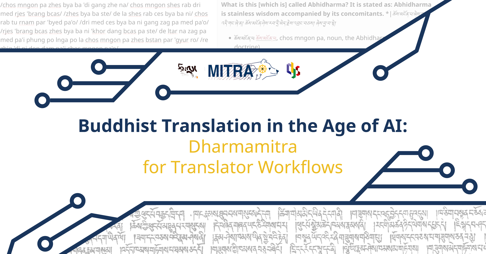
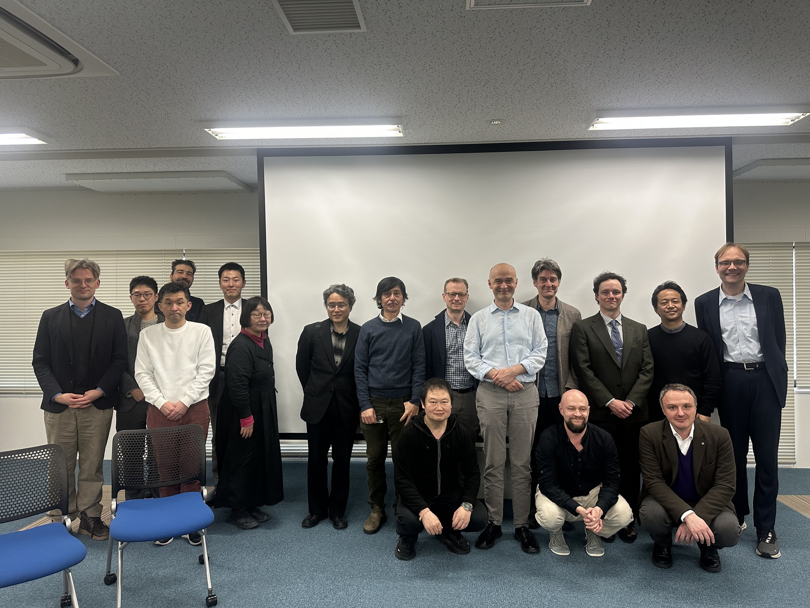

# Organized Events

## July 11, 2026: Translation in the Age of AI: Dharmamitra for Translator Workflows

Dive into Dharmamitra and see how AI’s shaking up translator workflows!

Welcome to Translation in the Age of AI, a global interactive workshop designed to bridge translation and philology in the Buddhist textual world with cutting-edge digital humanities infrastructure. This event explores how modern AI tools can be integrated to support, enhance, and optimize translation and philological research workflows.

We provide a deep dive into the MITRA framework, offering translators, scholars, and digital humanities researchers a practical look at the current capabilities of the system, discuss real-world case studies, and give an outlook on agentic-driven translation workflows in the future.

**Date & Time**

Date: Saturday, July 11, 2026
Time: 11:00 AM – 3:00 PM EDT (New York Time) | 17:00 – 21:00 CET (Central European Time)
Platform: Live Zoom Broadcast (Access link will be sent to registered attendees)

**Workshop Agenda & Run-of-Show**

*11:00 AM EDT / 17:00 CET — Session 1*: Introduction to MITRA & Ecosystem Vision (45 min)

Lead Speaker: Sebastian Nehrdich, Assistant Professor, Center for Integrated Japanese Studies, Tohoku University.
Focus: A comprehensive overview of the MITRA architecture, the datasets, and its current capabilities

*12:00 PM EDT / 18:00 CET — Session 2*: Collaborative Case Studies & Participant-Material Review (90 min)

Moderators: Sára Csáki-Bertók and Sebastian Nehrdich
Focus: An interactive, hands-on workshop session where we discuss usecase examples and experiences with AI tools in an open conversation.
Who Should Attend?

This workshop is primarily designed for Translators , Buddhist Studies scholars, philologists, and digital humanities software developers.

**Participant Action Items & Submission Deadlines**

Material Submissions: To have your translation texts reviewed and integrated into Session 2's interactive session, please send us your material to dharmamitra-project@gmail.com no later than one week prior to the event date.
Zoom Delivery: The meeting link will be distributed automatically via Eventbrite to registered emails 24 hours prior to the event.

**[Go to Eventbrite to register!](https://www.eventbrite.de/e/translation-in-the-age-of-ai-dharmamitra-for-translator-workflows-tickets-1992334867220)**

---

## March 28–29, 2026: OCR and Beyond Workshop at Tohoku University

On March 28 (Sat) and 29 (Sun), Center for Integrated Japanese Studies (CIJS) at Tohoku University hosted the international workshop “OCR AND BEYOND” focusing on philology and digital archives in the age of AI. The workshop featured discussions on cutting-edge computer-aided annotation workflows, including Sanskrit studies utilizing Generative AI, the digitization of Tibetan, Nepalese, and Japanese Esoteric Buddhist texts, and the construction of structured corpora. 

Approximately 100 participants attended both in person and online, with registrations spanning 28 countries and regions. This highlighted the growing global interest in the field
of Digital Humanities and the academic application of AI, particularly OCR (Optical Character Recognition) technology. From CIJS, Assistant Professor Sebastian Nehrdich, who also served as the workshop
host, and Associate Professor Ryuta Kikutani delivered presentations. They introduced &quot;Dharmamitra,&quot; a machine translation model developed for classical Asian languages, and discussed the latest trends in the application of OCR within Tibetan Buddhist philology. Over the two-day event, a total of 12 research presentations and four themed discussion
sessions were held, fostering vibrant academic exchange and a lively sharing of ideas among participants from Japan and abroad.

 

