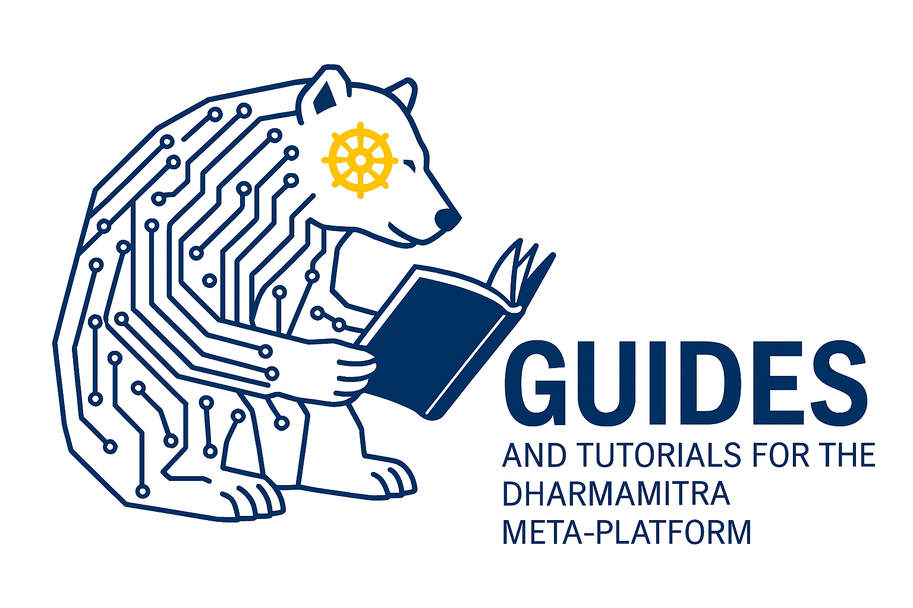

# Dharmamitra: Open Tools for Translation and Digital Philology of Ancient Asian Languages

*Accelerating research on Classical Asian source languages with modern machine‑learning workflows.*

  

## About Dharmamitra

**[Dharmamitra](https://dharmamitra.org)** is a meta‑platform that bundles state‑of‑the‑art NLP, OCR, information‑retrieval, and intertextuality exploration components for anybody working with the Ancient Asian languages Sanskrit, Pāli, Classical Chinese, and Tibetan. All code in this organisation is released under permissive licenses, and we provide large datasets in either public‑domain or under Creative Commons licensing.

---

## Acknowledgments

We extend our deepest gratitude to the **[Tsadra Foundation](https://tsadra.org)** for their generous financial and spiritual support, which has made all of this work possible. Their funding has been instrumental in supporting the hosting of our models and providing critical infrastructure for our deep learning research and development efforts.

--- 