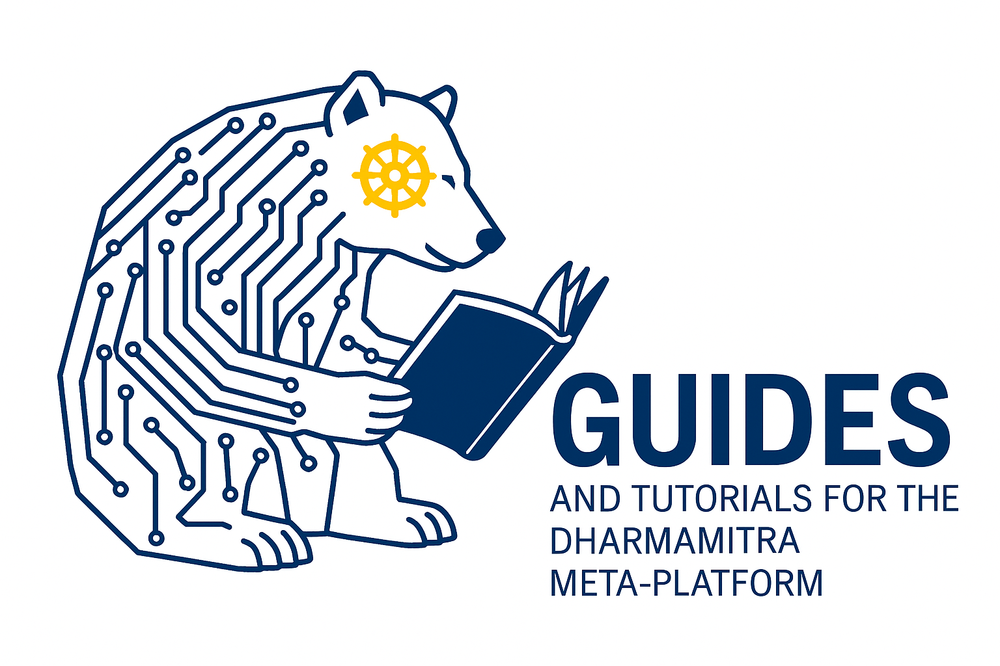

# Dharmamitra: Open Tools for Translation and Digital Philology of Ancient Asian Languages

*Accelerating research on Classical Asian languages with modern deep‑learning methods.*

  

## About Dharmamitra

**[Dharmamitra](https://dharmamitra.org)** is a meta‑platform that bundles state‑of‑the‑art NLP, OCR, information‑retrieval, and intertextuality exploration components for anybody working with the Ancient Asian languages Sanskrit, Pāli, Classical Chinese, and Tibetan. All code in this organisation is released under permissive licenses, and we provide large datasets in either public‑domain or under Creative Commons licensing.

The user guides currently available on this website do not yet reflect the updated Dharmamitra user interface. We appreciate your patience while our team is actively working on revising them.

---

## News

<!-- Each news item links to its section in news.md -->
- [April, 2026: Dharmamitra Platform Update – Introducing Explore](news.md#april-2026-dharmamitra-platform-update–introducing-explore)
- [April, 2026: Dharmamitra and Buddha Nexus Ecosystems in the age of AI (Workshop)](news.md#dharmamitra-and-buddha-nexus-ecosystems-in-the-age-of-ai-with-dr-sebastien-nehrdich)
- [March 2026: OCR and Beyond Workshop at Tohoku University](news.md#ocr-and-beyond-workshop-at-tohoku-university)
- [March 2026: Dharmamitra: A Platform to Support Research across Language Boundaries on Buddhist Textual Material](news.md#dharmamitra-a-platform-to-support-research-across-language-boundaries-on-buddhist-textual-material)
- [March 2026: DharmaNexus as a Multilingual Graph of Buddhist Intertextuality: Design Choices, Research Uses, and Future Applications](news.md#dharmanexus-as-a-multilingual-graph-of-buddhist-intertextuality-design-choices-research-uses-and-future-applications)
- [March 13, 2026: Is this the end of (Buddhist) philology as we know It? If so, what’s next?](news.md##is-this-the-end-of-buddhist-philology-as-we-know-it-if-so-whats-next)
- [February 2026: Dharmamitra Board of Advisors](news.md#dharmamitra-board-of-advisors)
- [January 2026: Dharmamitra: A data-driven platform for the research of Buddhist texts in multiple languages using advanced NLP methods](news.md#dharmamitra-a-data-driven-platform-for-the-research-of-buddhist-texts-in-multiple-languages-using-advanced-nlp-methods)
- [January 2026: AI and Indological/Buddhological researches: Dharmamitra/Dharmanexus and its Application](news.md#ai-and-indological-buddhological-researches-dharmamitra-dharmanexus-and-its-application)
- [December 2025: Translation, OCR, and Semantic Retrieval: Current Status and Future Outlook of the Dharmamitra Ecosystem](news.md#translation-ocr-and-semantic-retrieval-current-status-and-future-outlook-of-the-dharmamitra-ecosystem)
- [December 2025: Dharmamitra: A Platform that Makes Translation and Discovery of Buddhist Texts Possible Across Language Barriers](#dharmamitra-a-platform-that-makes-translation-and-discovery-of-buddhist-texts-possible-across-language-barriers)
- [December 2025: Building the Foundations of Buddhist Philology through Digital Humanities: Exploring the Potential of the Tohoku University Digital Archives (ToUDA)](news.md#building-the-foundations-of-buddhist-philology-through-digital-humanities-exploring-the-potential-of-the-tohoku-university-digital-archives-touda)
- [November 2025: From OCR via Machine Translation to Semantic Search: The Dharmamitra AI stack for Multilingual Buddhist Philology](news.md#from-ocr-via-machine-translation-to-semantic-search-the-dharmamitra-ai-stack-for-multilingual-buddhist-philology)
- [November 2025: Integration of Digital Dictionary of Buddhism](news.md#integration-of-digital-dictionary-of-buddhism)
- [October 2025: Integration of Christian Steinert's Tibetan-English-Sanskrit Dictionary](news.md#integration-of-christian-steinerts-tibetan-english-sanskrit-dictionary)
- [October 2025:Buddhist Philology and AI](news.md#buddhist-philology-and-ai)
- [September 2025: Dharmamitra and DharmaNexus presentation at the National Taiwan University](news.md#dharmamitra-and-dharmanexus-presentation-at-the-national-taiwan-university)
- [August 2025: Dharmamitra & DharmaNexus: A New Set of Digital Tools for the Philological Study of Buddhist Texts](news.md#dharmamitra-dharmanexus-a-new-set-of-digital-tools-for-the-philological-study-of-buddhist-texts)
- [August 2025: MITRA at IABS Conference, Leipzig](news.md#mitra-new-research-tools-for-a-paradigm-shift-in-the-philological-study-of-buddhist-texts-based-on-machine-translation-technology)
- [June 2025: Deep Neural Embeddings at Hanmun Lab Workshop](news.md#is-training-deep-neural-embeddings-worth-the-effort-a-preliminary-investigation-of-different-representation-methods-for-semantic-similarity-tasks-in-buddhist-chinese-and-related-languages-of-the-buddhist-tradition)
- [June 2025: From Sthiramati to Dharmamitra at Keio University](news.md#from-sthiramati-to-dharmamitra-developing-digital-tools-for-a-new-age-of-philological-buddhist-studies)
- [March 2025: Machine Translation for Asian Studies Workshop](news.md#march-2025-machine-translation-for-asian-studies-workshop)
- [March 2025: MITRA Search at CEAL Technology Forum](news.md#mitra-search-building-information-retrieval-systems-for-classical-asian-languages-in-the-age-of-ai)
- [2025: MITRA-zh-eval Paper Published](news.md#2025-mitra-zh-eval-paper-published)

[See all news →](news.md)

--- 
