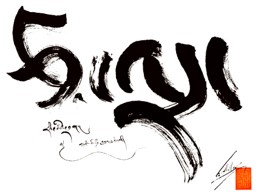
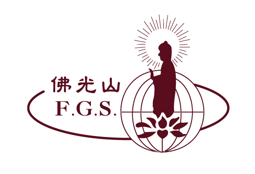

# Dharmamitra: Open Tools for Translation and Digital Philology of Ancient Asian Languages

*Accelerating research on Classical Asian source languages with modern machine‑learning workflows.*

  

## About Dharmamitra

**[Dharmamitra](https://dharmamitra.org)** is a meta‑platform that bundles state‑of‑the‑art NLP, OCR, information‑retrieval, and intertextuality exploration components for anybody working with the Ancient Asian languages Sanskrit, Pāli, Classical Chinese, and Tibetan. All code in this organisation is released under permissive licenses, and we provide large datasets in either public‑domain or under Creative Commons licensing.

---

## Acknowledgments

We are immensely grateful to the following organizations for their generous support, which has been pivotal to the development of Dharmamitra. Their contributions have been instrumental in advancing our research and enabling us to provide our tools and data to the community.

<table>
  <tr>
    <td align="center" width="200"></td>
    <td><strong><a href="https://tsadra.org">Tsadra Foundation</a></strong> For their generous financial and spiritual support, which has made all of this work possible. Their funding has been instrumental in supporting the hosting of our models and providing critical infrastructure for our deep learning research and development efforts.</td>
  </tr>
  <tr>
    <td align="center" width="200"></td>
    <td><strong><a href="https://foguang.ai">Foguang.ai</a></strong> For their collaboration on the development of Chinese to English translation for Venerable Master Hsing Yun's Complete Works and other Buddhist texts.</td>
  </tr>
  <tr>
    <td align="center" width="200"></td>
    <td><strong><a href="https://monlam.ai">Monlam AI</a></strong> For their partnership in machine translation data collection for Tibetan and English.</td>
  </tr>
  <tr>
    <td align="center" width="200"></td>
    <td><strong><a href="https://www.ymfz.org/?lang=en">Kumarajiva Project</a></strong> For their contributions to the development of Tibetan &lt;> Chinese capabilities and user interface for specific translation purposes.</td>
  </tr>
  <tr>
    <td align="center" width="200"></td>
    <td><strong><a href="http://www.iitkgp.ac.in/">Indian Institute of Technology, Kharagpur</a></strong> For their work on the development of Sanskrit translation model development and Sanskrit &lt;> English dataset compilation.</td>
  </tr>
  <tr>
    <td align="center" width="200"></td>
    <td><strong><a href="https://ai4bharat.org/">AI4Bharat</a></strong> For their collaboration on the development of Sanskrit data collection.</td>
  </tr>
</table>

--- 