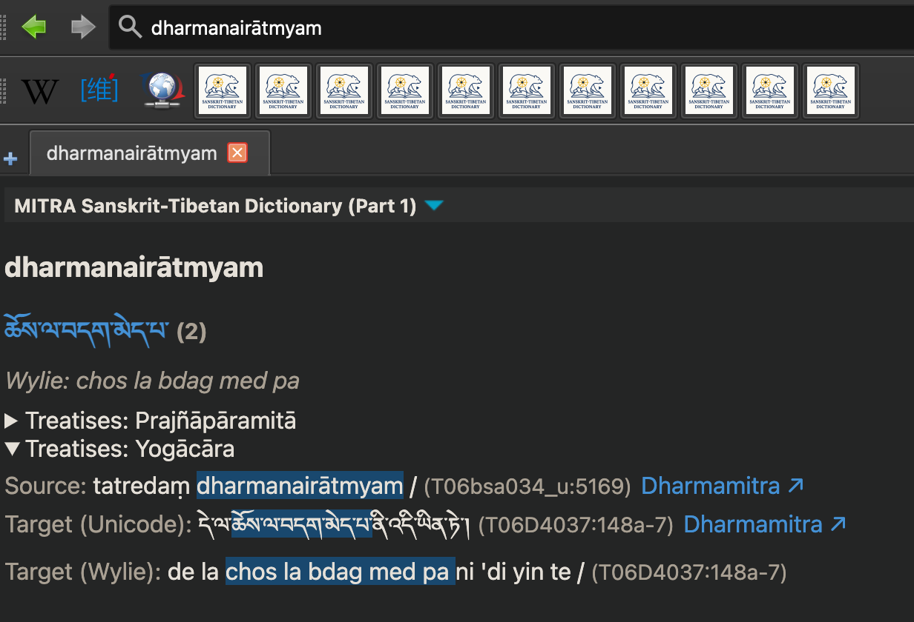

## MITRA Dictionaries

### Sanskrit-Tibetan

> Auto‑generated **Sanskrit ↔ Tibetan** dictionaries derived from 600 k parallel sentence pairs (≈ 4 million entries).

These StarDict format dictionaries are created from parallel sentence alignments to assist in research for Sanskrit<>Tibetan. They can be used with GoldenDict and other compatible viewers.

- **Dictionaries Available:**
  - **MITRA sa-bo:** Sanskrit to Tibetan dictionary
    - **Download:** [mitra-dictionary-skt-tib.zip](https://dharmamitra.org/pub/dictionaries/mitra-dictionary-skt-tib.zip)
  - **MITRA bo-sa:** Tibetan to Sanskrit dictionary
    - **Download:** [mitra-dictionary-tib-skt.zip](https://dharmamitra.org/pub/dictionaries/mitra-dictionary-tib-skt.zip)

**Format:** StarDict (works with GoldenDict, StarDict, SDCV)  
**Size:** ~10 GB per direction after unzip  
**License:** CC BY‑SA 4.0  
**Where to Download:** See GitHub repository [dharmamitra‑stardict‑dictionaries ↗](https://github.com/dharmamitra/dharmamitra-stardict-dictionaries)  

**Warning:** Each dictionary will require more than 10GB of disk space after unzipping! These contain over 4m headword entries based on 600,000 parallel Sanskrit-Tibetan sentence pairs.

#### Features

- Bilingual translations of terms and phrases automatically extracted from large sets of parallel sentence pairs
- StarDict format compatible with many dictionary applications
- Comprehensive coverage based on extensive parallel corpus

#### Limitations

- The phrase entries of the dictionaries are automatically generated, they are not manually checked and we don't claim that these are exhaustive resources
- The boundary detection is not always reliable
- These are not manually curated dictionaries, so use with caution!
- The size is large with millions of entries based on more than 1.7m sentence pairs combined.

#### Usage

1. Download the desired dictionary files from the GitHub repository
2. Unzip them to your favorite folder
3. Install a StarDict-compatible dictionary viewer (like GoldenDict, StarDict, or SDCV)
4. Add your favorite folder with the dictionary files to your viewer
5. Start looking up terms!

#### Compatible Software

These dictionaries work with:
- **GoldenDict**
- **StarDict**
- **SDCV** (StarDict Console Version)
- And other StarDict-compatible dictionary programs

**Note:** An Apple Dictionary compatible version is currently under preparation and will be released soon.

### Sanskrit-Chinese

> **Note:** The Sanskrit ↔ Chinese dictionary is currently under preparation and will be coming soon.

--- 