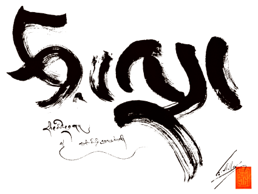
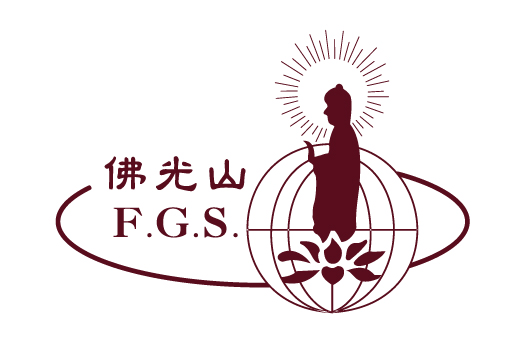

## Acknowledgments

We are immensely grateful to the following organizations for their generous support. Their contributions have been instrumental in advancing our research and enabling us to provide our tools and data to the community.

<table>
  <tr>
    <td align="center" width="200"></td>
    <td><strong><a href="https://tsadra.org">Tsadra Foundation</a></strong> For their generous financial and spiritual support. Their funding has been instrumental in supporting the hosting of our models and providing critical infrastructure for our deep learning research and development efforts.</td>
  </tr>
  <tr>
    <td align="center" width="200"></td>
    <td><strong><a href="https://foguang.ai">Foguang.ai</a></strong> For their collaboration, including financial support, on the development of Chinese to English translation for Venerable Master Hsing Yun's Complete Works and other Buddhist texts.</td>
  </tr>
  <tr>
    <td align="center" width="200"></td>
    <td><strong><a href="https://monlam.ai">Monlam AI</a></strong> For their partnership in machine translation data collection, alignment, and model training for Tibetan and English.</td>
  </tr>
  <tr>
    <td align="center" width="200"></td>
    <td><strong><a href="https://www.ymfz.org/?lang=en">Kumarajiva Project</a></strong> For their contributions to the development of Tibetan &lt;> Chinese capabilities and user interface for specific translation purposes.</td>
  </tr>
  <tr>
    <td align="center" width="200"></td>
    <td><strong><a href="http://www.iitkgp.ac.in/">Indian Institute of Technology, Kharagpur</a></strong> For their work on the development of Sanskrit translation models and Sanskrit &lt;> English dataset compilation.</td>
  </tr>
  <tr>
    <td align="center" width="200"></td>
    <td><strong><a href="https://ai4bharat.org/">AI4Bharat</a></strong> For their collaboration on Sanskrit data collection.</td>
  </tr>
</table>

---

# MITRA Tools

The MITRA platform offers a suite of powerful, free-to-use tools designed for researchers, translators, and students working with classical Buddhist texts. These tools leverage state-of-the-art AI and NLP models to provide advanced capabilities for translation, grammatical analysis, search, and more.

Each tool is designed to be intuitive and powerful, catering to both new users and seasoned academics. Explore the individual tool sections to learn more about their features and how to use them.

## Available Tools

- [**MITRA Translate**](translate.md): Neural machine translation for Sanskrit, Pāli, Tibetan, and Classical Chinese.
- [**MITRA Sanskrit Grammar**](sanskrit_grammar.md): Detailed grammatical analysis for Sanskrit texts.
- [**MITRA OCR**](ocr.md): High-accuracy text extraction from documents.
- [**MITRA Search**](search.md): Semantic search across multilingual text collections.
- [**MITRA Deep Research**](deep_research.md): An advanced translation mode with integrated research context. 