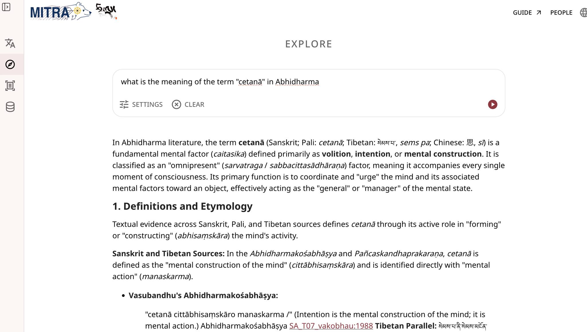
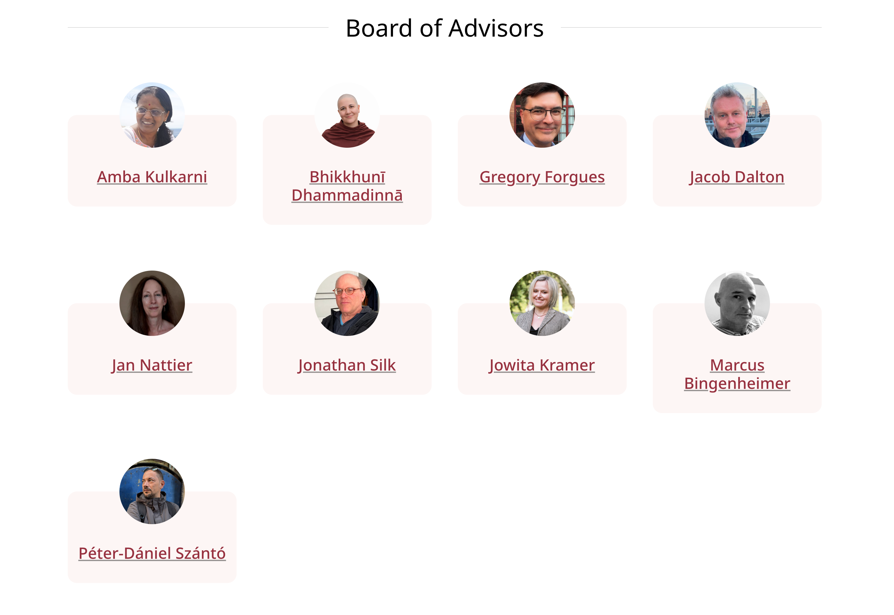
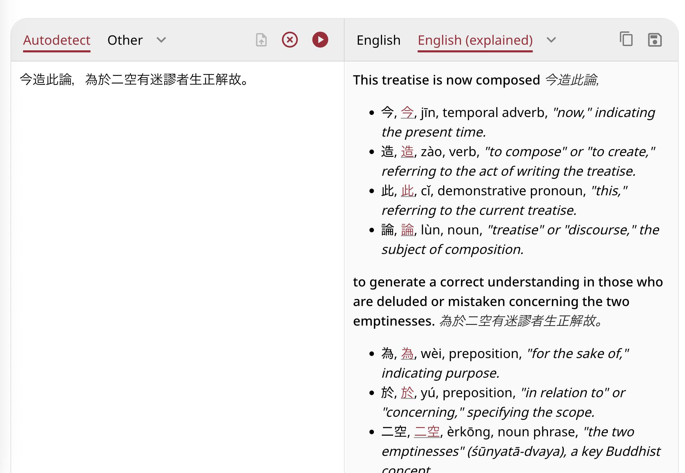
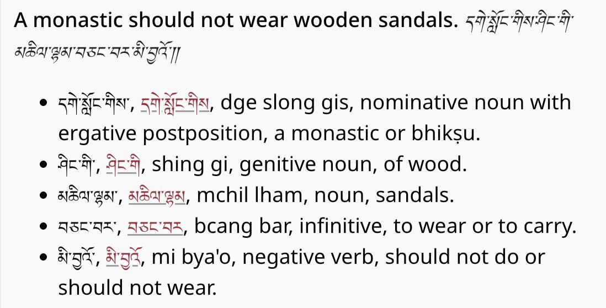
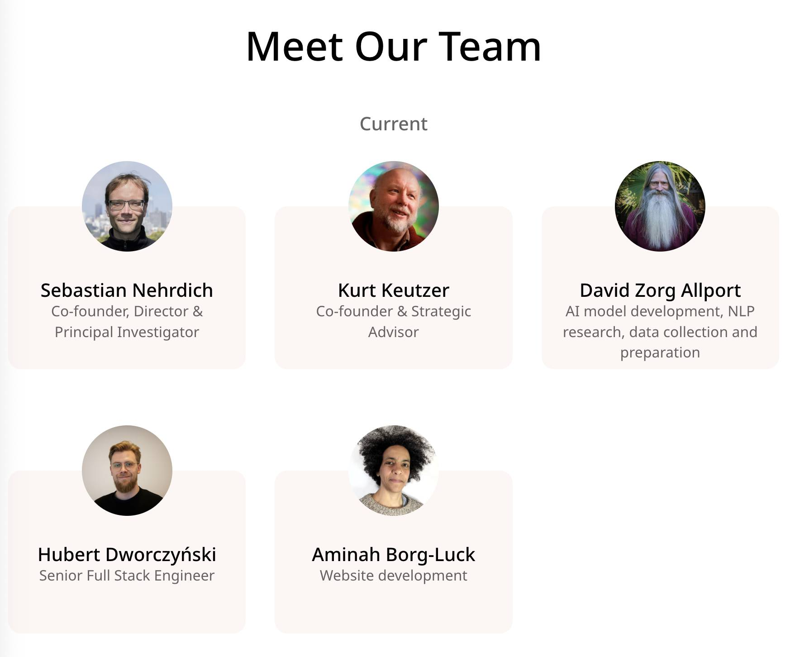

# News

## April, 2026: Dharmamitra Platform Update – Introducing Explore

We’ve been very busy over the last months, and we are thrilled to announce a massive update to the Dharmamitra platform! 

Here is what’s new:
🔍 From "Search" to "Explore"
We’ve officially replaced MITRA Search with MITRA Explore. This isn’t just a name change, it’s a significant upgrade in capabilities.
We have added text summaries to the search results, and you can now filter results based on language, collection, category, and even individual texts, which was not possible before with Deep Research. This brings a lot of the power of Deep Research to MITRA Search, and we are happy that this is now possible! 

🌐 Enhanced Translation Control
You now have more flexibility than ever when using the MITRA translator.  For example: You can now translate into Modern Chinese while simultaneously activating the Grammar or  Deep Research mode for maximum accuracy and context.

📚 Massive Library Expansion
Our database has grown significantly! We’ve added a lot of new material over the past few months.
For Tibetan: 
རིན་ཆེན་གཏེར་མཛོད་ (Rinchen Terdzö): The Precious Treasury of Revelations.
གདམས་ངག་རིན་པོ་ཆེའི་མཛོད། (Damngak Rinpoché Dzö): The Treasury of Precious Instructions.

For Chinese (In collaboration with Kanripo / 漢籍リポジトリ): 
漢籍 Kanripo Classics (經部): The Confucian Classics and related fundamental texts.
漢籍 Kanripo Masters (子部): Works from various schools of philosophy and masters.
漢籍 Kanripo Daoist Canon (道部): Comprehensive material from the Daoist tradition.

We hope that these updates make the daily work with our platform more productive and pleasant!

---

## April 11, 2026: Dharmamitra and Buddha Nexus Ecosystems in the age of AI with Dr. Sebastien Nehrdich

An online workshop held by the Centre for Buddhist Studies, Kathmandu University at Rangjung Yeshe Institute.

**[Read more.](events/invited_talks.md)**

---

## March 28–29, 2026: OCR and Beyond Workshop at Tohoku University
 
On March 28 (Sat) and 29 (Sun), Center for Integrated Japanese Studies (CIJS) at Tohoku University hosted the international workshop “OCR AND BEYOND” focusing on philology and digital archives in the age of AI. The workshop featured discussions on cutting-edge computer-aided annotation workflows, including Sanskrit studies utilizing Generative AI, the digitization of Tibetan, Nepalese, and Japanese Esoteric Buddhist texts, and the construction of structured corpora. 

**[Read more.](events/organized_events.md)**

---

## March 20, 2026: Dharmamitra: A Platform to Support Research across Language Boundaries on Buddhist Textual Material

Lecture, The Gandhāra Corpora Lecture Series, Faculty of arts and Philosophy, Ghent University, Belgium.

The Center for Integrated Japanese Studies (CIJS) at Tohoku University will host a two-day workshop titled "Japanese Studies in Japan and Belgium" on March 19 and 20, 2026. The event will be held at Ghent University, Belgium, and is co-organized with the Ghent University Institute for Japanese Studies.

**[Read more.](events/invited_talks.md)**

---

## March 17, 2026: DharmaNexus as a Multilingual Graph of Buddhist Intertextuality: Design Choices, Research Uses, and Future Applications

Locating textual parallels, translations, citations, and topically related passages across vast collections of texts in multiple languages is a basic requirement of philological work in Buddhist Studies.

**[Read more.](events/invited_talks.md)**

---

## March 13, 2026: Is this the end of (Buddhist) philology as we know It? If so, what’s next?

Hybrid lecture, International Institute for Asian Studies, Leiden University, Netherlands

With rapidly growing digital collections and increasingly powerful AI and information-retrieval tools, textual Buddhist Studies is undergoing a paradigm shift. How are these new tools already influencing research practice, and what new questions and methods might they enable in the near future?

**[Read more.](events/invited_talks.md)**

---

## February, 2026: Dharmamitra Board of Advisors

We are happy to announce that Dharmamitra now features a [**Board of Advisors](https://rnd.dharmamitra.org/people)**. They will advise on the kind of data that Dharmamitra includes, on the functionality and design of our various applications, and on making sure that we keep providing tools and utility that really matter for our core audience. We are more than grateful for their support and expertise!

---

## January 31, 2026: Dharmamitra: A data-driven platform for the research of Buddhist texts in multiple languages using advanced NLP methods

*Forum, 第30回情報知識学フォーラム「文化と社会をとらえるデータサイエンスの最前線」 (The 30th Information and Knowledge Science Forum: Data Science at the Forefront of Capturing Culture and Society), Japan Society for Information and Knowledge (情報知識学会), Doshisha University Osaka Satellite Campus, Osaka, Japan*

**[Read more.](events/invited_talks.md)**

---

## January 10, 2026: AI and Indological/Buddhological researches: Dharmamitra/Dharmanexus and its Application

*Conference, インド思想史学会 第32回学術大会 (Association for the Study of the History of Indian Thought, The 32nd Annual Conference), Kyoto University, Faculty of Letters Building, Lecture room 7, Kyoto, Japan (Face-to-face & Online)*

Co-presented with Kengo Harimoto (University of Naples "L'Orientale"). Recent advances in AI are transforming many areas of scholarship, and the field of Indology is no exception. We introduced Dharmamitra, an AI-assisted research environment that provides advanced tools for philological work across the Classical Asian languages: Pāli, Sanskrit, Tibetan, and Chinese.

**[Read more.](events/invited_talks.md)**

---

## December 21, 2025: Translation, OCR, and Semantic Retrieval: Current Status and Future Outlook of the Dharmamitra Ecosystem

Symposium, 仏教学とデジタル・ヒューマニティーズ国際シンポジウム (Buddhist Studies and Digital Humanities International Symposium), Tokyo, Japan

I presented on the current status and future outlook of the Dharmamitra ecosystem, covering translation, OCR, and semantic retrieval capabilities for Buddhist texts. The symposium was held at Tokyo International Forum Hall D5 and focused on "The Significance of Humanities and Research Infrastructure Development in the DX-AI Era."

**[Read more.](events/invited_talks.md)**

---

## December 21, 2025: Dharmamitra: A Platform that Makes Translation and Discovery of Buddhist Texts Possible Across Language Barriers

On December 21, we where part of the panel “AI in the Fo Guang Dictionary of Buddhism English Translation Project and MITRA” at the 11th Symposium of Humanistic Buddhism 

I presented on the Dharmamitra platform as part of the panel "AI in the Fo Guang Dictionary of Buddhism English Translation Project and MITRA." The panel showcased how emerging AI tools support large-scale Buddhist translation and lexicographical research. I introduced Dharmamitra as a collaborative AI-driven platform developed by Tohoku University with the Tsadra Foundation and Berkeley AI Research Lab, which employs Large Language Models for high-quality machine translation of Sanskrit, Pali, Tibetan, and Chinese alongside vector-based semantic retrieval.

**[Read more.](events/invited_talks.md)**

---

## December 3, 2025: Building the Foundations of Buddhist Philology through Digital Humanities: Exploring the Potential of the Tohoku University Digital Archives (ToUDA)

Workshop and Symposium, Center for Integrated Japanese Studies (CIJS), Tohoku University, Sendai, Japan

**[Read more.](events/invited_talks.md)**

---

## November 25, 2025: From OCR via Machine Translation to Semantic Search: The Dharmamitra AI stack for Multilingual Buddhist Philology

Talk, at 서울대학교 인공지능 디지털인문학센터 해외연구자 초청포럼 (Seoul National University AI Digital Humanities Center Overseas Researcher Invitation Forum), Seoul, South Korea

**[Read more.](events/invited_talks.md)**

---

## November 4, 2025: Integration of Digital Dictionary of Buddhism

We now also feature integration of the fantastic Digital Dictionary of Buddhism (DDB,  電子佛教辭典) by Charles Muller for the English-Explained translation mode on Chinese Input!

---

## October 31, 2025: Integration of Christian Steinert's Tibetan-English-Sanskrit Dictionary

A small but mighty Dharmamitra update: The English (explained) translation mode now features links into Christian Steinert's fantastic Tibetan dictionary! We are also working actively on offering similar functionality for Sanskrit and Chinese as well.

---

## October 27, 2025: Dharmamitra Team Update

The Dharmamitra team has seen some changes recently! Most notably, with the move to Tohoku as the new academic anchor, Sebastian steps in as Director and Principal Investigator, while Kurt takes on the role as Strategic Advisor.
We are also more than happy to welcome back Hubert Dworczyński to the team, who has been working already on the BuddhaNexus platform in 2019!

---

## October 4, 2025: Buddhist Philology and AI

Talk, Goodman Lecture Series No. 32, Khyentse Foundation, Online

This talk will provide an overview of the tools that the Dharmamitra project currently offers the Buddhist Studies community, with a focus on machine translation and cross-lingual search for philological use cases. 

**[Read more.](events/invited_talks.md)**

---

## September 15, 2025: Dharmamitra and DharmaNexus presentation at the National Taiwan University

**[Read more.](events/invited_talks.md)**

---

## August 18, 2025: Dharmamitra & DharmaNexus: A New Set of Digital Tools for the Philological Study of Buddhist Texts

Presentation, ELTE BTK, Kodály terem, Budapest, Hungary

**[Read more.](events/invited_talks.md)**

---

## August 2025: MITRA at IABS Conference, Leipzig

We will present **"[MITA: New Research Tools for a Paradigm Shift in the Philological Study of Buddhist Texts Based on Machine Translation Technology](https://conference.uni-leipzig.de/iabs2025/academic-program/)"** at the IABS conference in Leipzig. Please join our panel with Marcus Bingenheimer on Tuesday, August 12!

**[Read more.](events/invited_talks.md)**

---

## July 26, 2025: Announcing the launch of MITRA Search, MITRA Deep Research, and DharmaNexus

We are thrilled to announce the official launch of a number of new flagship capabilities: **[MITRA Search](mitra_tools/search.md)**, **[MITRA Deep Research](mitra_tools/deep_research.md)**, and **[DharmaNexus](dharmanexus.md)**. These tools represent a new era for Dharmamitra, offering powerful search, in-depth analysis, and intertextuality exploration coupled tightly with the existing capabilities of Dharmamitra. We invite you to explore them and see how they can help your research and study.

The archived BuddhaNexus codebase is here: **[https://github.com/BuddhaNexus/](https://github.com/BuddhaNexus/)**

Development of Dharmamitra, including DharmaNexus, is happening here: **[https://github.com/dharmamitra](https://github.com/dharmamitra)**

**[Watch: "Chat About Dharmamitra Updates in 2025 and DharmaNexus"](https://www.youtube.com/watch?v=cgF9NvnGXG8)**

---

## June 17, 2025: Deep Neural Embeddings at Hanmun Lab Workshop – Is training deep neural embeddings worth the effort? A preliminary investigation of different representation methods for semantic similarity tasks in Buddhist Chinese and related languages of the Buddhist tradition

We presented "Is training deep neural embeddings worth the effort? A preliminary investigation of different representation methods for semantic similarity tasks in Buddhist Chinese and related languages of the Buddhist tradition" at the "Navigating Indra’s Net: Digital Approaches to Text Reuse-based Inter-textuality in Pre-Modern East Asian Texts" online workshop at the Hanmun Lab, Ruhr-Universität Bochum.

**[Read more.](events/invited_talks.md)**

---

## June 2025: From Sthiramati to Dharmamitra at Keio University

We presented "From Sthiramati to Dharmamitra: Developing Digital Tools for a New Age of Philological Buddhist Studies" at the DH International Workshop at Keio University, Tokyo.

**[Read more.](events/invited_talks.md)**

---

## March 2025: Machine Translation for Asian Studies Workshop

We conducted a hands-on workshop on "Machine Translation for Asian Studies" at the [Annual Conference of the Association of Asian Studies](https://www.asianstudies.org/conference/) in Columbus, Ohio.

**[Read more.](events/invited_talks.md)**

---

## March 2025: MITRA Search at CEAL Technology Forum

We presented "MITRA Search: Building Information Retrieval Systems for Classical Asian Languages in the Age of AI" at the [CEAL Technology Forum](https://www.eastasianlib.org/) in Columbus, Ohio.

**[Read more.](events/invited_talks.md)**

---

## 2025: MITRA-zh-eval Paper Published

Our paper **"[MITRA‑zh‑eval: Using a Buddhist Chinese Language Evaluation Dataset to Assess Machine Translation and Evaluation Metrics](https://aclanthology.org/2025.nlp4dh-1.12/)"** has been published in the *Proc. 5th Intl. Conf. on NLP for Digital Humanities* (**[details](https://dharmamitra.github.io/dharmamitra-guides/publications/#2025)**).

---

## December 2024: MITRA Search at Tokyo Symposium

We presented "MITRA Search: Exploring Buddhist Literature Preserved in Classical Asian Languages with Multilingual Approximate Search" at the International Symposium "Buddhist Studies and Digital Humanities" in Tokyo, Japan.

**[Read more.](https://dharmamitra.github.io/dharmamitra-guides/events/invited_talks/#MITRA-Search-at-Tokyo-Symposium)**

---

## November 2024: Dharmamitra Presentation in Heidelberg

We gave a presentation on "Dharmamitra" online for an audience in Heidelberg, Germany ([recording](https://www.youtube.com/watch?v=SMD6RGr-w9Q)).

**[Read more.](https://dharmamitra.github.io/dharmamitra-guides/events/invited_talks/#dharmamitra)**

---

## November 2024: Dharmamitra Toolkit at Naples Workshop

We presented "Dharmamitra: Developing a Toolkit for Philological Work on Premodern Asian Low-Resource Languages" at a workshop at L'Orientale University of Naples, Italy.

**[Read more.](https://dharmamitra.github.io/dharmamitra-guides/events/invited_talks/#dharmamitra-developing-a-toolkit-for-philological-work-on-premodern-asian-low-resource-languages)**

---

## October 2024: MITRA at Johns Hopkins University

We presented "[MITRA: Beyond Just Machine Translation for Premodern Asian Low Resource Languages](https://dharmamitra.github.io/dharmamitra-guides/presentations/#mitra-beyond-just-machine-translation-for-premodern-asian-low-resource-languages)" at Johns Hopkins University, Baltimore, MD.

---

## October 2024: Dharmamitra Search at UC Berkeley

We presented "[Dharmamitra Search: Leveraging Multilingual Language Models for Search and Detection of Textual Reuse across Diverse Text Collections](https://dharmamitra.github.io/dharmamitra-guides/presentations/#dharmamitra-search-leveraging-multilingual-language-models-for-search-and-detection-of-textual-reuse-across-diverse-text-collections)" at the AI and the Future of Buddhist Studies Conference at UC Berkeley.

---

## October 2024: ByT5-Sanskrit Paper Published

Our paper "[One Model is All You Need: ByT5-Sanskrit, a Unified Model for Sanskrit NLP Tasks](https://aclanthology.org/2024.findings-emnlp.805/)" has been published in the *Findings of the Association for Computational Linguistics: EMNLP 2024* ([details](https://dharmamitra.github.io/dharmamitra-guides/publications/#2024)).

---

## August 2024: MITRA at PNC 2024, Seoul

We presented "[MITRA: Developing Language Models for Machine Translation and Search in Buddhist Source Languages](https://dharmamitra.github.io/dharmamitra-guides/presentations/#mitra-developing-language-models-for-machine-translation-and-search-in-buddhist-source-languages)" at the PNC 2024 Annual Conference in Seoul, Korea.

---

## 2024: Breakthroughs in Tibetan NLP & Digital Humanities

Our paper "[Breakthroughs in Tibetan NLP & Digital Humanities](https://www.asian-studies.org/publications/Revue-Etudes-Tibetaines/)" has been published in the *Revue d’Études Tibétaines* ([details](https://dharmamitra.github.io/dharmamitra-guides/publications/#2024)).

---

## April 2024: Massive Multilingual MT and Search at NTU, Taipei

We presented "[Massive Multilingual Machine Translation and Search for Buddhist Languages: The Mitra Project](https://dharmamitra.github.io/dharmamitra-guides/presentations/#massive-multilingual-machine-translation-and-search-for-buddhist-languages-the-mitra-project)" at National Taiwan University (NTU), Taipei, Taiwan.

---

## March 2024: Dharmamitra at National University of Singapore

We presented "[Dharmamitra: Enabling Massive Multilingual Machine Translation for Ancient Languages of the Buddhist Tradition](https://dharmamitra.github.io/dharmamitra-guides/presentations/#dharmamitra-enabling-massive-multilingual-machine-translation-for-ancient-languages-of-the-buddhist-tradition)" at the National University of Singapore.

---

## February 2024: Sanskrit MT & LLMs at Auroville

We gave an online presentation on "[Machine Translation and LLM-Powered Grammatical Explanation for Sanskrit](https://dharmamitra.github.io/dharmamitra-guides/presentations/#machine-translation-and-llm-powered-grammatical-explanation-for-sanskrit)" at the International Sanskrit Computational Linguistics Conference in Auroville, India.

---

## 2023: Intertextuality of Abhidharma Texts Paper

Our paper "[Observations on the Intertextuality of Selected Abhidharma Texts Preserved in Chinese Translation](https://doi.org/10.3390/rel14070911)" has been published in the journal *Religions* ([details](https://dharmamitra.github.io/dharmamitra-guides/publications/#2023)).

---

## 2023: MITRA-zh Paper Published

Our paper "[MITRA‑zh: An efficient, open machine translation solution for Buddhist Chinese](https://aclanthology.org/2023.nlp4dh-1.29/)" has been published in the *Proceedings of the Joint 3rd Intl. Conf. on NLP for Digital Humanities & 8th IWCLUL* ([details](https://dharmamitra.github.io/dharmamitra-guides/publications/#2023)).

---

## June 2023: MITRA NLP Tools in Hong Kong

We presented "[MITRA: Developing Natural Language Processing Tools for the Languages of Buddhist Literature](https://dharmamitra.github.io/dharmamitra-guides/presentations/#mitra-developing-natural-language-processing-tools-for-the-languages-of-buddhist-literature)" in Hong Kong.

---

## June 2023: MT for Buddhist Texts in Seoul

We presented "[Developing Machine Translation for ancient Buddhist texts in canonical languages](https://dharmamitra.github.io/dharmamitra-guides/presentations/#developing-machine-translation-for-ancient-buddhist-texts-in-canonical-languages)" in Seoul, Korea.

---

## April 2023: Shared Semantic Vector Space in Vienna

We presented "[Creating a Shared Semantic Vector Space for Buddhist Languages](https://dharmamitra.github.io/dharmamitra-guides/presentations/#creating-a-shared-semantic-vector-space-for-buddhist-languages)" in Vienna, Austria. 
